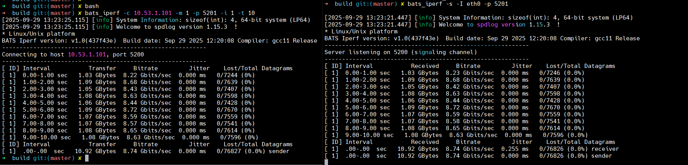

# BATS Protocol Next

## Basic concepts

- **`IOContext`**:
  The context of the IO operation, which is responsible for watching the IO events for those registered connections.
  In each process, it is required to have at least one `IOContext` instance and this only one IO context instance can be shared by multiple protocol instance `BatsProtocol`.
- **`BatsProtocol`**:
  The protocol instance of BATS protocol, which can start a new connection to remote server or wait for a new connection from remote client.
  It must be initialized with a `IOContext` instance.
- **`BatsConfiguration`**: 
  The configuration interface of BATS protocol,
  which is used to set the transmission mode,
  congestion control and other parameters.
- **`IBatsConnection`**:
  The connection of BATS protocol, which is used to send and receive messages.
  `IBatsConnection` is managed by BATS protocol core, users can't create or destroy it directly.
- **`Callback functions`**:
  There are two callback functions in BATS protocol, `ListenCallback` is used to receive listen related events,
  and `ConnectionCallback` is used to receive connection related events.
  In most cases, the asynchronous events are emitted by `IOContext`'s thread while the direct failure of API calls are emitted by the users' thread.

## Test tools

```text
./bin/bats_iperf -h
[2025-09-29 13:21:33.386] [info] System Information: sizeof(int): 4, 64-bit system (LP64)
[2025-09-29 13:21:33.386] [info] Welcome to spdlog version 1.15.3  !
* Linux/Unix platform
BATS Iperf version: v1.0(437f43e)  Build date: Sep 29 2025 12:20:08 Compiler: gcc11 Release
Usage: bats_iperf [options]
Options:
  -t <time>        : Test duration in seconds (default: 10)
  -i <interval>    : Interval for reporting results in seconds (default: 1)
  -I <interface>   : The name of the interface
  -P <num_streams> : Number of parallel streams (default: 1)
  -r               : Enable reverse mode (server to client)
  -p <port>        : Port number to use for the data channel (default: 5201); and
                     The port of signaling channel is set to `port - 1`.
  -m <mode>        : Protocol mode (0: BTP, 1: BRTP, 2: BRCTP, 3: TRANSPARENT, default: BTP)
                     When run as server, this option is ignored.
  -s               : Run as server
  -c <host>        : Run as client and connect to <host>
  -f <file>        : Run as client to send the file
  -l <logfile>     : Log file to write iperf output (default: stdout)
  -L <logfile path>: Log path to write bats protocol log (default: )
  -b               : Max allowed sending rate in Mbps, only valid for clients
  -h               : Show this help message
  -d               : Emit debugging output
  -T               : Show precise time wall clock in the reports
  -C               : Enable the data compression
```

Logging output of a loopback test with the network coding enabled protocol BRTP:



## Performance matrix of BRTP

| Loss Rate/Latency | 10ms        | 30ms        | 50ms        | 70ms        |
| ----------------- | ----------- | ----------- | ----------- | ----------- |
| 0.0%              | 949.5 Mbps  | 940.1 Mbps  | 927.81 Mbps | 979.71 Mbps |
| 2.0%              | 888.33 Mbps | 907.4 Mbps  | 757.49 Mbps | 719.43 Mbps |
| 4.0%              | 879.99 Mbps | 811.36 Mbps | 683.54 Mbps | 485.85 Mbps |
| 6.0%              | 853.18 Mbps | 762.74 Mbps | 662.22 Mbps | 540.73 Mbps |
| 8.0%              | 800.47 Mbps | 720.81 Mbps | 555.95 Mbps | 430.73 Mbps |
| 10.0%             | 786.96 Mbps | 759.27 Mbps | 510.21 Mbps | 455.38 Mbps |

> [!TIP] 
> Definitions and abbreviations
> - 1. All tests were tested with the fixed Bandwidth 1000Mbps
> - 2. Latency: the one-way delay of the link/path.
> - 3. Loss Rate: the packet loss takes effect on the bidirection of the link/path.
> - 4. Data format in the cell: <br>[Delivery rate]
>    - Delivery rate: The average receiving rate during the test.
> - 5. Latency and Loss Rate are simulated in [Oasis](https://github.com/n-hop/oasis/blob/main/docs/tc-strategy.md).
>

## Performance matrix of TCP BBR

| Loss Rate/Latency | 10ms       | 30ms       | 50ms       | 70ms       |
| ----------------- | ---------- | ---------- | ---------- | ---------- |
| 0.0%              | 938.0 Mbps | 913.0 Mbps | 622.0 Mbps | 432.0 Mbps |
| 10.0%             | 461.0 Mbps | 270.0 Mbps | 175.0 Mbps | 13.4 Mbps  |

> [!TIP] 
> - Using the same test environment as BRTP.
> - Kernel version: 5.15.0-153-generic
