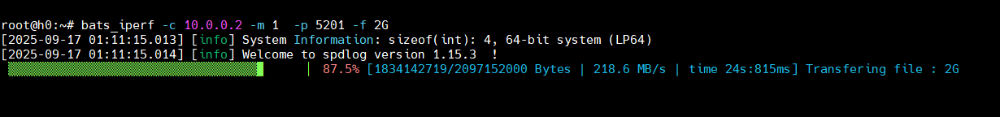
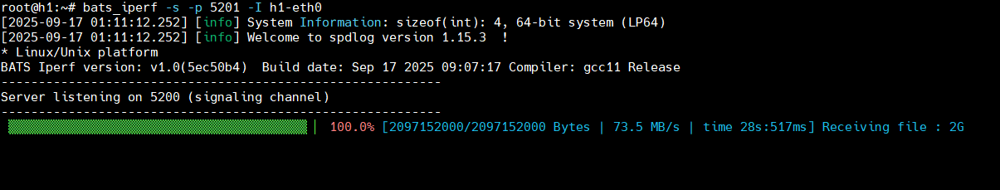
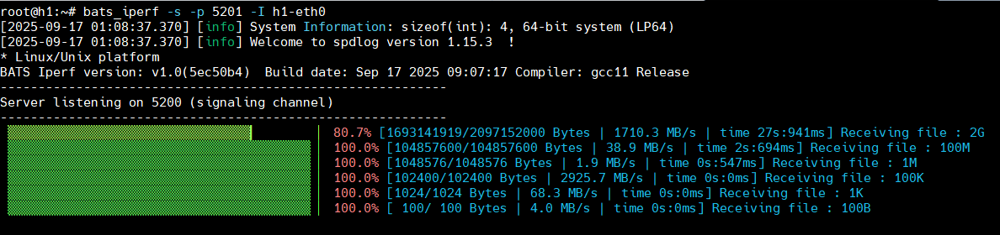
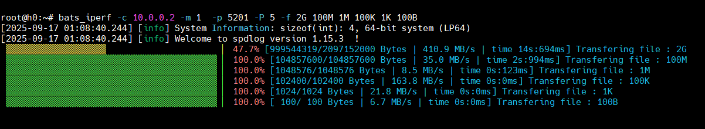

## bats_iperf file transfer

Limitations:

- only supports up to 10 files at one time.
- Only support Density compression when `-C` is set.
  - density benchmark: https://quixdb.github.io/squash-benchmark/
  - should consider both the compression ratio and speed.
- bats_iperf does not check the file integrity after receiving files. (Do the check manually)
- progress bar is disabled when debug mode is enabled.

### Case 1:

Single file, single stream, single available path, no sha256 file.

```bash
# Server side
./bin/bats_iperf -s -I eth0 -p 5201

# generate test files
dd if=/dev/zero bs=1M count=2000 > 2G

# Client side
./bin/bats_iperf -c 10.53.1.101 -m 1 -p 5201 -f 2G
```

Server side output:



Client side output:


### Case 2:

Single file, single stream, single available path, with sha256 files (`2G.sha256sum`).

```bash
# Server side
./bin/bats_iperf -s -I eth0 -p 5201

# Client side
./bin/bats_iperf -c 10.53.1.101 -m 1 -p 5201 -f 2G

```

Different from Case 1, bats_iperf client will sync the `2G.sha256sum` files to the server side. Actually, bats_iperf client will search for the sha256 file in the same directory of the file to be transferred.

### Case 3:

Multiple files, single stream, single available path:

```bash
# Server side
./bin/bats_iperf -s -I eth0 -p 5201

# Client side
./bin/bats_iperf -c 10.53.1.101 -m 1 -p 5201 -f 2G 100M 1M 100K 1K 100B
```

In this case, bats_iperf client will transfer 3 files to the server side one by one.

### Case 4:

Multiple files, Multiple streams, single available path:

```bash
# Server side
./bin/bats_iperf -s -I eth0 -p 5201

# Client side
./bin/bats_iperf -c 10.53.1.101 -m 1 -p 5201 -P 5 -f 2G 100M 1M 100K 1K 100B

# file integrity check on server side
md5sum 100B 100K 100M 1K 1M 2G
```

In this case, bats_iperf client has the new option `-P 5` to create 5 parallel streams to transfer 6 files to the server side at the same time.



